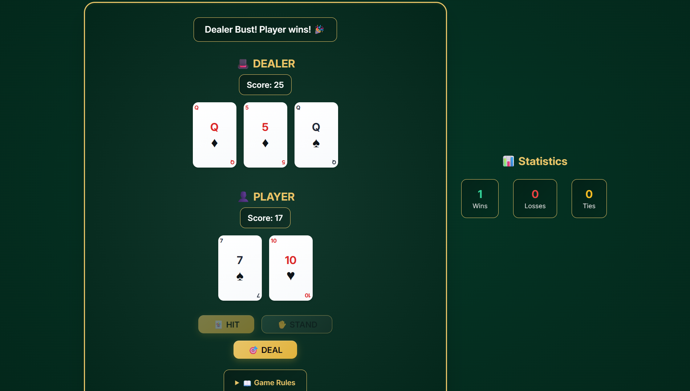

# Blackjack（21 點）小遊戲

## 專案簡介  
這是一個簡易的 **Blackjack（21 點）小遊戲**。  
玩家與莊家（電腦）輪流抽牌，比較誰的點數最接近 **21** 並且不超過。

**遊戲功能包含：**  
- 玩家與莊家的基本發牌流程  
- 玩家可選擇要牌（**Hit**）或停牌（**Stand**）  
- 自動計算 **A** 的點數（1 或 11）  
- 判斷勝負結果並輸出遊戲結束訊息

此專案是以 **vibe coding** 的方式開發，也就是透過在 [Replit](https://replit.com) 上與 AI 對話協作完成程式。

---

## 使用技術  
- **開發環境**：Replit  
- **開發方式**：vibe coding（透過 ChatGPT prompt 協助程式生成與修改）  

---

## 如何執行  
1. 將專案 clone 或下載至本地端（或直接在 Replit 中開啟專案）  
2. 進入專案資料夾  
3. 在 **PowerShell**（或終端機）輸入以下指令啟動：  
   ```bash
   npm start
   ```  
   > 注意：若在本地端執行，需先安裝 **Node.js**（或依專案實際設定安裝相對應環境）。  
   若你在 Replit 上開啟專案，通常只要按下 **Run** 鈕即可。

---

## 遊戲截圖  
  

---

## Prompt（開發過程紀錄）  
以下為進行 **vibe coding** 時所使用的 prompt：

```
幫我建立一個 Blackjack（21點）web app小遊戲。  

遊戲需求如下：  

1.基本規則：  
  ．使用一副 52 張牌（不含鬼牌）。  
  ．玩家與電腦莊家（dealer）對戰。  
  ．玩家與莊家初始各兩張牌（莊家其中一張蓋牌）。  
  ．玩家可以選擇「Hit（要牌）」或「Stand（停牌）」。  
  ．玩家若超過 21 點立即爆掉（Bust）。  
  ．當玩家 Stand 後，莊家依規則行動：莊家點數 < 17 必須自動 Hit，>= 17 必須 Stand。  
  ．最後比點數，接近 21 且未爆者勝；若平手則算平局。  

2.牌點數計算：  
  ．2~10 為數字本身。  
  ．J、Q、K 都算 10。  
  ．A 可算 1 或 11（取最有利玩家或莊家的值）。  

3.UI 介面：  
  ．畫面上方顯示莊家的牌與分數（未翻開的那張牌等到結束時才顯示）。  
  ．畫面下方顯示玩家的牌與分數。  
  ．提供按鈕：Hit、Stand、Restart。  
  ．顯示勝負結果（玩家贏、莊家贏、平局）。  

4.遊戲流程：  
  ．點「開始遊戲」後，自動發牌。  
  ．玩家點 Hit 就抽一張牌並更新分數。  
  ．玩家點 Stand 後，莊家自動抽牌直到規則限制。  
  ．最後翻開莊家蓋牌並顯示結果。  
  ．可以按 Restart 重開新局。  
```

---

## 開發心得  
原本計畫製作的是 **德州撲克**，但在 Replit 免費用戶的資源限制下，難以完成穩定可玩的版本。經過多次嘗試，最終改為實作規則較簡單且能完整呈現遊戲流程的 **Blackjack（21 點）**，並以 vibe coding 完成開發。

---

## 版權與貢獻  
歡迎提出 issue 或 PR。如果要轉載或修改，請保留原作者資訊與本 README。

